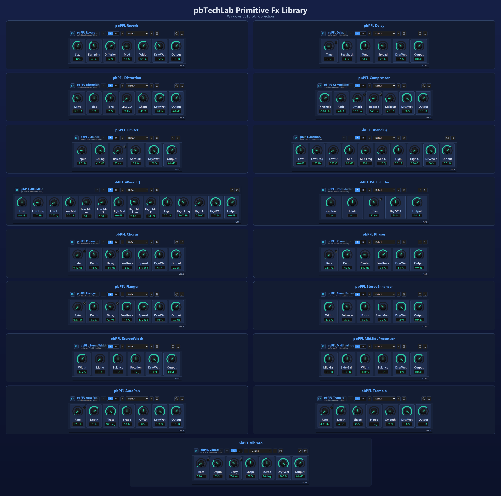

# pbTechLab Primitive Fx Library

[日本語 README](README.ja.md)



pbTechLab Primitive Fx Library is a collection of lightweight audio effect plug-ins built with C++ and JUCE 8. The library currently ships 17 effect plug-ins for Windows and macOS, with VST3 and AAX installer packages provided in the release assets.

The plug-ins share one native DSP core and one WebView-based editor framework. Each plug-in has its own product name, plug-in code, parameter set, embedded HTML/CSS/JavaScript interface, DAW automation mapping, preset state support, bypass handling, and input/output metering.

## Release Packages

The GitHub release includes installer packages, not build products committed to the repository.

| Platform | Installer | Included formats |
|---|---|---|
| Windows 64-bit | `pbTechLab_PrimitiveFxLibrary_1.0.0_Windows_Setup.exe` | VST3, AAX |
| macOS universal | `pbTechLab_PrimitiveFxLibrary-1.0.0-macOS.pkg` | VST3, AAX |

The macOS package is signed, notarized, and stapled. The Windows AAX plug-ins are PACE-signed. The Windows installer itself is intentionally unsigned because no public-trust Authenticode certificate is included in this repository.

## Included Plug-Ins

| Plug-in | Main controls | Purpose |
|---|---|---|
| pbPFL Reverb | Pre Delay, Size, Damping, Diffusion, Mod, Width, Dry/Wet, Output | Algorithmic stereo reverb for ambience, room tone, and wide spatial tails. |
| pbPFL Delay | Time, Feedback, Tone, Spread, Mod Rate, Mod Depth, Dry/Wet, Output | Stereo delay with feedback coloration, spread, and modulation. |
| pbPFL Distortion | Drive, Bias, Tone, Low Cut, Shape, Presence, Dry/Wet, Output | Saturation and distortion processor for harmonic edge and tone shaping. |
| pbPFL Compressor | Threshold, Ratio, Attack, Release, Knee, Makeup, Dry/Wet, Output | Studio-style dynamics control with parallel compression support. |
| pbPFL Limiter | Input, Ceiling, Release, Soft Clip, Stereo Link, Density, Dry/Wet, Output | Peak limiting and loudness control with soft clipping behavior. |
| pbPFL 3BandEQ | Low, Low Freq, Mid, Mid Freq, Mid Q, High, Dry/Wet, Output | Three-band equalizer for broad tonal shaping. |
| pbPFL 4BandEQ | Low, Low Freq, Low Mid, Low Mid Freq, High Mid, High Mid Freq, Dry/Wet, Output | Four-band equalizer for more focused tone correction. |
| pbPFL PitchShifter | Semitone, Cents, Grain, Crossfade, Tone, Stability, Dry/Wet, Output | Time-domain pitch shifting for harmonizing and sound design. |
| pbPFL Chorus | Rate, Depth, Delay, Feedback, Spread, Tone, Dry/Wet, Output | Stereo chorus for widening, movement, and modulation color. |
| pbPFL Phaser | Rate, Depth, Center, Feedback, Stages, Spread, Dry/Wet, Output | Moving all-pass phaser with feedback and stereo spread. |
| pbPFL Flanger | Rate, Depth, Delay, Feedback, Spread, Tone, Dry/Wet, Output | Stereo flanger with short modulated delay and feedback. |
| pbPFL StereoEnhancer | Width, Enhance, Focus, Bass Mono, Air, Center, Dry/Wet, Output | Stereo enhancement and bass mono management. |
| pbPFL StereoWidth | Width, Mono, Balance, Rotation, Low Mono, Focus, Dry/Wet, Output | Utility processor for stereo width, mono blend, balance, and rotation. |
| pbPFL MidSideProcessor | Mid Gain, Side Gain, Width, Balance, Tilt, Mono Bass, Dry/Wet, Output | Mid-side gain and width processing. |
| pbPFL AutoPan | Rate, Depth, Phase, Shape, Offset, Smooth, Dry/Wet, Output | Auto-panning modulation with stereo phase control. |
| pbPFL Tremolo | Rate, Depth, Shape, Phase, Smooth, Bias, Dry/Wet, Output | Amplitude modulation for pulse, movement, and rhythmic effects. |
| pbPFL Vibrato | Rate, Depth, Delay, Shape, Spread, Smooth, Dry/Wet, Output | Pitch modulation and vibrato-style movement. |

## Editor

Each plug-in embeds a WebView editor from its `mock` folder. The same HTML mock can be opened directly in a browser for visual inspection, while the JUCE plug-in uses the embedded assets through binary data.

Editor features include:

- fixed-size GUI tailored to each plug-in parameter count;
- horizontal knob layout with consistent `Dry/Wet` and `Output` placement;
- drag, fine-drag, wheel, and double-click reset interaction;
- A/B slot buttons and preset selector UI;
- Save and Help controls;
- centralized help dialog showing `pbTechLab`, the library version, and a clickable `https://pbtechlab.com/` link;
- input and output meter display;
- host-facing parameter updates through the JUCE WebView bridge.

## DSP And State

The shared processor in `Common/PrimitiveFxProcessor.*` handles APVTS parameter creation, state serialization, metering, channel layout support, and effect dispatch. Each plug-in selects its DSP behavior through compile-time definitions supplied by its own `CMakeLists.txt`.

Dry/Wet is implemented as a true mix between the unprocessed buffer and the processed buffer:

```text
output = dry * (1 - wet) + processed * wet
```

At 100% Wet, the explicit dry buffer is not mixed in. Some processors, such as EQ, dynamics, stereo tools, panning, and tremolo, naturally produce a processed signal that still contains recognizable source material.

## Build From Source

Requirements:

- CMake 3.22 or newer
- C++17 compiler
- JUCE 8 compatible build environment
- Visual Studio 2022 for Windows
- Xcode for macOS
- AAX SDK only when building AAX
- PACE signing tools only for distributable AAX builds

Basic Windows VST3/Standalone development build:

```powershell
cmake -S . -B build -G "Visual Studio 17 2022" -A x64
cmake --build build --config Release
```

Release-format VST3/AAX build example:

```powershell
cmake -S . -B build-release -G "Visual Studio 17 2022" -A x64 `
  -DPB_ENABLE_AAX=ON `
  -DPB_BUILD_STANDALONE=OFF `
  -DPB_AAX_SDK_PATH="path/to/aax-sdk"

cmake --build build-release --config Release
```

To use a local JUCE checkout, pass:

```powershell
-DPB_JUCE_LOCAL="path/to/JUCE"
```

If no local JUCE path is provided, CMake fetches JUCE 8.0.0.

## Repository Privacy

This repository intentionally excludes local build logs, installer artifacts, server-specific scripts, API credentials, signing credentials, private keys, machine names, and local handover files. Installer binaries are distributed only through GitHub Releases.
